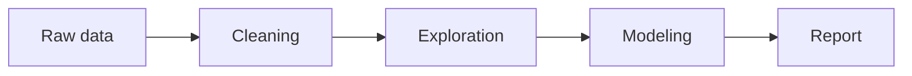

This guide explains how to configure and write content for your LeFolio Academic site. Everything lives in the `Content/` folder.
## Configuration

Edit `Content/config.yaml` to control site metadata, the homepage, author profile, and navigation.

```yaml
site:
  title: "Your Name"
  description: "Short site description"
  url: "https://username.github.io/repo-name"
  basePath: "/repo-name"   # use "" for username.github.io

home: "About.md"           # top-level or section page

author:
  name: "Your Name"
  pronouns: "she/her"
  bio: "Short sidebar bio"
  avatar: "Assets/profile.jpg"
  location: "City, Country"
  employer: "University of Example"
  links:
    email: "you@example.edu"
    orcid: "https://orcid.org/..."
    github: "https://github.com/..."

navigation:
  - Projects
  - Publications
  - CV
  - Guide: "Pages/Guide.md"
```

### Site settings

| Key | Purpose |
|-----|---------|
| `site.title` | Browser tab title and sidebar footer |
| `site.description` | SEO description |
| `site.url` | Canonical site URL |
| `site.basePath` | GitHub Pages subpath (e.g. `/lefolio-academic`) |

For a user site at `username.github.io`, set `basePath: ""`. For a project site at `username.github.io/repo-name`, set `basePath: "/repo-name"`.

### Homepage

`home` points to any markdown file, relative to `Content/`:

```yaml
home: "About.md"          # top-level page at /
home: "Pages/home.md"     # page inside a section folder
```

Top-level files like `About.md` or `CV.md` can live directly in `Content/`.

### Author profile

The sidebar shows avatar, bio, location, employer, and links. Supported link keys include `email`, `orcid`, `googlescholar`, `github`, and `linkedin`.

Place images in `Content/Assets/` and reference them as `Assets/filename.jpg`.

## Content structure

```
Content/
├── config.yaml
├── About.md              # can be used as homepage
├── CV.md                 # top-level page
├── Assets/
│   └── profile.jpg
├── Pages/
│   └── Guide.md
├── Projects/
│   └── My Project.md
└── Publications/
    └── paper.md
```

Each folder under `Content/` (except `Assets/`) is a **section**. Each `.md` file becomes a page.

### Section index note

If a section folder contains a note with the **same name** as the folder (e.g. `Publications/Publications.md`), that note is **not** listed as a page. Instead:

- Its body is shown **above** the section listing
- Its frontmatter configures the listing

```yaml
---
title: Publications
sort: date          # date | order | title
display: publication_thumbnail   # list | publication_thumbnail | grid
---
```

For `publication_thumbnail`, each page can set:

```yaml
---
title: Paper title
authors:
  - A. Author
  - B. Coauthor
venue: Journal or proceedings, 2024
thumbnail: preview.png
---
```

`thumbnail` can be a filename, relative path, or `[[wikilink]]` to an image under `Content/`.

For `grid` (useful for projects), each card shows thumbnail, title, and subtitle:

```yaml
---
title: Project title
subtitle: Short tagline
start_date: 2025-08-01
thumbnail: preview.png
---
```

If `thumbnail` is omitted, the first image embed in the note is used, otherwise the first image in the same folder (preferring filenames that start with `0_`).
`sort: date` also honors `start_date` / `end_date`.

### Page frontmatter

Optional YAML at the top of any page:

```yaml
---
title: "Page title"
date: 2025-09-01
order: 1
permalink: custom-slug
published: false
---
```

| Field | Purpose |
|-------|---------|
| `title` | Display title (defaults to filename) |
| `date` | Sort key for listings |
| `order` | Manual sort order (lower = first) |
| `permalink` | URL slug override |
| `published` | Set to `false` to keep the note in the vault but omit it from the site |

A file `Publications/My Paper.md` with `permalink: my-paper` is served at `/Publications/my-paper/`.

## Navigation

The top navbar is driven by `navigation` in `config.yaml`. Each item can link to a **section** or a **specific page**.

### Auto-detection

When you list a name only, the site resolves it automatically:

- **Section folder exists** → links to the section index (e.g. `Projects` → `/Projects/`)
- **Top-level `.md` file exists** → links to that page (e.g. `CV` → `/CV/` from `CV.md`)

```yaml
navigation:
  - Projects        # Content/Projects/ folder → section
  - Publications    # Content/Publications/ folder → section
  - CV              # Content/CV.md → page
```

### Explicit page path

Point a nav label at any markdown file:

```yaml
navigation:
  - Guide: "Pages/Guide.md"
  - CV: "CV.md"
```

### Map syntax

You can also use a YAML map:

```yaml
navigation:
  Projects:
  Publications:
  CV: CV.md
  Guide: Pages/Guide.md
```

## Markdown

LeFolio supports standard Markdown, GitHub Flavored Markdown (GFM), and Obsidian-style syntax.

### Headings, lists, and tables

```markdown
## Section heading

- Bullet item
- **Bold** and *italic*

| Column A | Column B |
|----------|----------|
| Value 1  | Value 2  |
```

### Wikilinks

Link to other pages using Obsidian-style double brackets:

```markdown
See [[brdf]] for details.
Read more on [[Publications/delaunay|the Delaunay paper]].
```

### Image embeds

Embed images from anywhere under `Content/`:

```markdown
![[Assets/profile.jpg]]
![[Assets/profile.jpg|200]]
![[photo.jpg|200|left|wrap]]
![[photo.jpg|300|center]]
![[photo.jpg|200|right|wrap]]
```

Parameters after `|` are optional and can appear in any order:

| Parameter | Effect |
|-----------|--------|
| `200` (number) | Width in pixels |
| `left`, `right`, `center` | Alignment |
| `wrap` | Float beside text; text wraps around the image |

`wrap` without an alignment defaults to `right`.

## Math

Inline math uses single dollar signs:

```markdown
The equation $E = mc^2$ is famous.
```

Block math uses double dollar signs on their own lines:

```markdown
$$
\int_0^\infty e^{-x^2}\, dx = \frac{\sqrt{\pi}}{2}
$$
```

Math is rendered with KaTeX.

## Mermaid diagrams

Use a fenced `mermaid` code block:

````markdown

````

## Plotly charts

Use a fenced `plotly` code block with JSON:

````markdown
```plotly
{
  "data": [{
    "x": [1, 2, 3, 4],
    "y": [10, 15, 13, 17],
    "type": "scatter",
    "mode": "lines+markers",
    "name": "Enrollment"
  }],
  "layout": {
    "title": "Weekly enrollment",
    "xaxis": { "title": "Week" },
    "yaxis": { "title": "Students" }
  }
}
```
````

The JSON follows the standard [Plotly chart schema](https://plotly.com/javascript/reference/). You can include `data`, `layout`, and `config` keys.

## Development

```bash
npm run dev      # sync content + watch + dev server
npm run build    # production static export
```

Edit files in `Content/` — changes sync automatically during development.
