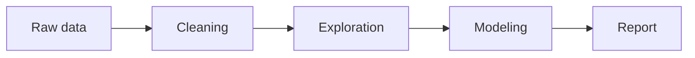

This course introduces Python, statistics, and visualization for graduate students.

## Topics

1. Data wrangling with pandas
2. Visualization
3. Basic machine learning

## Workflow diagram



## Sample plot

```plotly
{
  "data": [{
    "x": [1, 2, 3, 4],
    "y": [10, 15, 13, 17],
    "type": "scatter",
    "mode": "lines+markers",
    "name": "Enrollment"
  }],
  "layout": {
    "title": "Weekly enrollment",
    "xaxis": { "title": "Week" },
    "yaxis": { "title": "Students" }
  }
}
```
